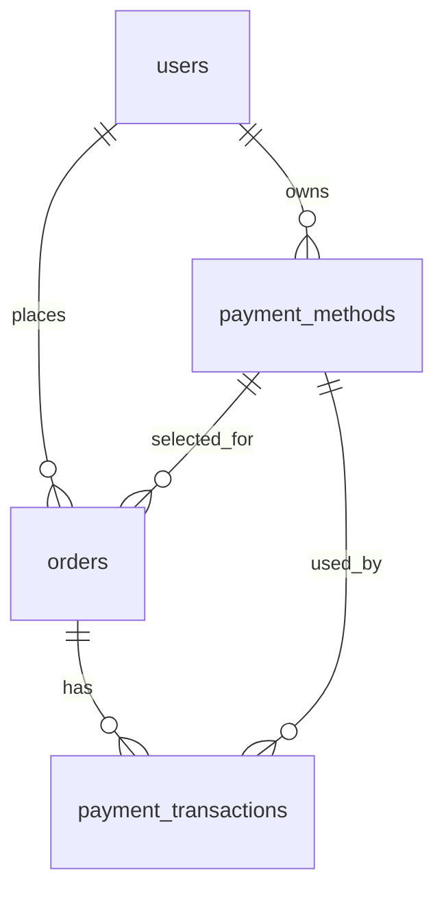

# Phân tích ERD PharmaIntel AI — Bản hoàn chỉnh v3

> Vai trò phân tích: kỹ sư thiết kế phần mềm / database designer  
> Mục tiêu: rà soát ERD hiện tại, chỉ ra điểm cần cải tiến, chuẩn hóa cho SQL Server và xuất bộ tài liệu có thể dùng để dựng sơ đồ ERD.

---

## 1. Kết luận nhanh

Thiết kế hiện tại đã đủ tốt cho **MVP cấp frontend/prototype**: có người dùng, chẩn đoán AI, thuốc, giỏ hàng, đơn hàng, đơn thuốc, lịch sử sức khỏe, nhắc thuốc, địa chỉ, phương thức thanh toán và thông báo.

Tuy nhiên, nếu triển khai thật trên **SQL Server** và mở rộng thành sản phẩm y tế/dược phẩm, cần cải tiến. Các điểm quan trọng nhất là:

1. **Không dùng `ENUM`, `BOOLEAN`, `TIMESTAMP` theo kiểu MySQL/PostgreSQL trong SQL Server**.  
   SQL Server nên dùng:
   - `NVARCHAR(...) + CHECK` thay cho `ENUM`
   - `BIT` thay cho `BOOLEAN`
   - `DATETIME2` thay cho `TIMESTAMP` vì `TIMESTAMP` trong SQL Server thực chất là `ROWVERSION`, không phải ngày giờ.

2. **Cần dùng `NVARCHAR` thay vì `VARCHAR`** vì dữ liệu có tiếng Việt: tên người dùng, thuốc, bác sĩ, địa chỉ, triệu chứng.

3. **Các bảng nghiệp vụ còn thiếu để ERD chạy được ngoài thực tế**:
   - `payment_transactions`: lưu từng giao dịch thanh toán, trạng thái, mã giao dịch cổng thanh toán.
   - `medication_reminder_logs`: lưu từng lần nhắc thuốc đã uống/chưa uống/bỏ qua.
   - `prescription_documents`: lưu ảnh/PDF đơn thuốc, trạng thái xác minh.
   - `pharmacist_chat_sessions`, `pharmacist_chat_messages`: làm cho bảng `pharmacists` có quan hệ nghiệp vụ thật, không còn bị độc lập.
   - `user_consents`: lưu lịch sử đồng ý điều khoản, quyền riêng tư, cảnh báo AI y tế.
   - `audit_logs`: lưu lịch sử thao tác quan trọng trên dữ liệu nhạy cảm.

4. **Đơn hàng cần snapshot thông tin giao hàng/thanh toán**.  
   Không nên chỉ FK tới `addresses` và `payment_methods`, vì người dùng có thể sửa địa chỉ hoặc ví sau khi đặt hàng. Vì vậy `orders` nên lưu thêm:
   - `shipping_recipient_name`
   - `shipping_phone`
   - `shipping_full_address`
   - `payment_type_snapshot`

5. **Nhắc thuốc nên tách lịch nhắc và log từng lần nhắc**.  
   Bảng `medication_reminders` chỉ nên mô tả lịch, còn trạng thái “đã uống / bỏ lỡ / bỏ qua” nên nằm ở `medication_reminder_logs`.

6. **Đơn thuốc nên cho phép bác sĩ ngoài hệ thống**.  
   Không nên bắt buộc mọi đơn thuốc phải có `doctor_id`. Bản cải tiến dùng:
   - `doctor_id` nullable
   - `doctor_name_snapshot` để lưu tên bác sĩ tại thời điểm kê đơn/upload

7. **Cần ràng buộc dữ liệu và index rõ ràng**:
   - Email user unique
   - SKU thuốc unique
   - Một user chỉ có một địa chỉ mặc định
   - Một user chỉ có một phương thức thanh toán mặc định
   - Giỏ hàng không trùng `user_id + medication_id`
   - Điểm tự tin AI nằm trong khoảng 0–100
   - Số lượng, giá, tổng tiền không âm

---

## 2. Phạm vi bản ERD hoàn chỉnh

Bản hoàn chỉnh đề xuất **30 bảng**, chia theo module:

| Nhóm | Bảng |
|---|---|
| Người dùng & bảo mật | `users`, `user_settings`, `user_consents`, `audit_logs` |
| Nhân sự y tế | `doctors`, `pharmacists` |
| Thông báo | `notifications` |
| Địa chỉ & thanh toán | `addresses`, `payment_methods`, `payment_transactions` |
| Danh mục thuốc | `categories`, `medications` |
| Chẩn đoán AI | `symptoms`, `diagnostic_sessions`, `diagnostic_session_symptoms`, `diagnostic_messages`, `diagnostic_results`, `diagnostic_result_medications` |
| Đơn thuốc | `prescriptions`, `prescription_items`, `prescription_documents` |
| Nhắc thuốc & sức khỏe | `medication_reminders`, `medication_reminder_logs`, `health_metrics` |
| Giỏ hàng & đơn hàng | `cart_items`, `orders`, `order_items` |
| Chat dược sĩ | `pharmacist_chat_sessions`, `pharmacist_chat_messages` |
| Cá nhân hóa AI | `ai_insights` |

---

## 3. Những cải tiến đã áp dụng vào bản thiết kế

### 3.1. Chuẩn hóa kiểu dữ liệu cho SQL Server

| Thiết kế cũ | Vấn đề | Thiết kế mới |
|---|---|---|
| `ENUM(...)` | SQL Server không có enum native | `NVARCHAR(...)` + `CHECK` |
| `BOOLEAN` | SQL Server dùng `BIT` | `BIT NOT NULL DEFAULT 0/1` |
| `TIMESTAMP` | Trong SQL Server là `ROWVERSION`, không phải thời gian | `DATETIME2(0)` |
| `VARCHAR` cho text tiếng Việt | Có thể lỗi Unicode | `NVARCHAR` |
| FK không có index | Query chậm khi join/filter | Thêm index cho các FK chính |
| Không có CHECK tiền/số lượng | Có thể lưu giá âm/số lượng âm | Thêm CHECK constraints |

---

### 3.2. Bổ sung nghiệp vụ thanh toán

Bảng `payment_methods` chỉ cho biết user chọn phương thức gì. Để vận hành thực tế cần thêm `payment_transactions`, vì một đơn hàng có thể:

- thanh toán thất bại rồi thanh toán lại;
- thanh toán qua MoMo/ZaloPay/VNPay;
- hoàn tiền;
- COD nhưng vẫn cần trạng thái thu tiền khi giao hàng.

Quan hệ mới:



---

### 3.3. Bổ sung xác minh đơn thuốc

Với thuốc cần kê đơn, hệ thống nên có luồng upload/xác minh đơn thuốc. Bổ sung bảng:

- `prescription_documents`: ảnh/PDF đơn thuốc
- `verification_status`: `pending`, `verified`, `rejected`
- `verified_by_pharmacist_id`: dược sĩ xác minh

Điều này giúp kiểm soát nghiệp vụ trước khi xuất hàng thuốc kê đơn.

---

### 3.4. Bổ sung log nhắc thuốc

Thiết kế cũ để `status` ngay trong `medication_reminders`, nhưng status này chỉ mô tả một thời điểm. Trong thực tế, một lịch nhắc có nhiều lần nhắc. Vì vậy cần tách:

- `medication_reminders`: cấu hình lịch nhắc
- `medication_reminder_logs`: từng lần nhắc cụ thể

Ví dụ: nhắc Paracetamol 08:00 mỗi ngày trong 5 ngày thì có 1 reminder và 5 log.

---

### 3.5. Bổ sung chat dược sĩ

Bảng `pharmacists` trong bản cũ độc lập. Vì UI có nút “Trò chuyện với Dược sĩ”, nên cần thêm:

- `pharmacist_chat_sessions`
- `pharmacist_chat_messages`

Nhờ vậy ERD thể hiện đúng flow user ↔ pharmacist.

---

### 3.6. Bổ sung quyền riêng tư và audit

Vì hệ thống xử lý dữ liệu sức khỏe, cần lưu:

- user đã chấp nhận điều khoản phiên bản nào;
- user đã chấp nhận cảnh báo “AI không thay thế bác sĩ” hay chưa;
- ai đã sửa/xác minh dữ liệu quan trọng.

Các bảng tương ứng:

- `user_consents`
- `audit_logs`

---

## 4. ERD tổng thể — Mermaid

```mermaid
erDiagram
    users ||--|| user_settings : "has"
    users ||--o{ user_consents : "accepts"
    users ||--o{ addresses : "has"
    users ||--o{ payment_methods : "has"
    users ||--o{ notifications : "receives"
    users ||--o{ diagnostic_sessions : "creates"
    users ||--o{ diagnostic_results : "receives"
    users ||--o{ prescriptions : "owns"
    users ||--o{ medication_reminders : "sets"
    users ||--o{ health_metrics : "records"
    users ||--o{ cart_items : "adds"
    users ||--o{ orders : "places"
    users ||--o{ pharmacist_chat_sessions : "starts"
    users ||--o{ ai_insights : "receives"
    users ||--o{ audit_logs : "acts"

    doctors ||--o{ prescriptions : "prescribes"
    pharmacists ||--o{ prescription_documents : "verifies"
    pharmacists ||--o{ pharmacist_chat_sessions : "handles"
    pharmacists ||--o{ pharmacist_chat_messages : "sends"

    categories ||--o{ categories : "parent_of"
    categories ||--o{ medications : "contains"

    symptoms ||--o{ diagnostic_session_symptoms : "selected"
    diagnostic_sessions ||--o{ diagnostic_session_symptoms : "has"
    diagnostic_sessions ||--o{ diagnostic_messages : "has"
    diagnostic_sessions ||--|| diagnostic_results : "produces"
    diagnostic_results ||--o{ diagnostic_result_medications : "suggests"
    medications ||--o{ diagnostic_result_medications : "suggested"

    prescriptions ||--o{ prescription_items : "contains"
    prescriptions ||--o{ prescription_documents : "has"
    prescription_items ||--o{ medication_reminders : "generates"
    medications ||--o{ prescription_items : "included"

    medication_reminders ||--o{ medication_reminder_logs : "creates"

    addresses ||--o{ orders : "used_for"
    payment_methods ||--o{ orders : "selected_for"
    orders ||--o{ order_items : "contains"
    orders ||--o{ payment_transactions : "has"
    payment_methods ||--o{ payment_transactions : "used_by"
    prescriptions ||--o{ orders : "supports"

    medications ||--o{ cart_items : "in_cart"
    medications ||--o{ order_items : "ordered"

    pharmacist_chat_sessions ||--o{ pharmacist_chat_messages : "contains"

    users {
        bigint id PK
        nvarchar full_name
        nvarchar email UK
        nvarchar password_hash
        nvarchar auth_provider
        bit is_terms_accepted
        bit is_active
        datetime2 created_at
        datetime2 updated_at
    }

    user_settings {
        bigint id PK
        bigint user_id FK_UK
        nvarchar dark_mode
        nvarchar language_code
        bit notification_enabled
        bit reminder_sound_enabled
    }

    user_consents {
        bigint id PK
        bigint user_id FK
        nvarchar consent_type
        nvarchar consent_version
        datetime2 accepted_at
        datetime2 revoked_at
    }

    doctors {
        bigint id PK
        nvarchar full_name
        nvarchar license_number UK
        nvarchar specialization
        nvarchar hospital
        bit is_active
    }

    pharmacists {
        bigint id PK
        nvarchar full_name
        nvarchar license_number UK
        bit is_online
        bit is_active
    }

    notifications {
        bigint id PK
        bigint user_id FK
        nvarchar notification_type
        nvarchar title
        bit is_read
        datetime2 created_at
    }

    addresses {
        bigint id PK
        bigint user_id FK
        nvarchar recipient_name
        nvarchar phone
        nvarchar province
        nvarchar district
        nvarchar ward
        bit is_default
        bit is_active
    }

    payment_methods {
        bigint id PK
        bigint user_id FK
        nvarchar payment_type
        nvarchar display_name
        nvarchar masked_account
        bit is_default
        bit is_active
    }

    payment_transactions {
        bigint id PK
        bigint order_id FK
        bigint payment_method_id FK
        nvarchar provider
        nvarchar provider_transaction_id
        decimal amount
        nvarchar status
    }

    categories {
        bigint id PK
        bigint parent_id FK
        nvarchar name
        nvarchar slug UK
        int display_order
        bit is_active
    }

    medications {
        bigint id PK
        nvarchar sku UK
        nvarchar name
        nvarchar generic_name
        decimal price
        decimal discount_percent
        bigint category_id FK
        bit is_prescription_required
        int stock_quantity
        bit is_active
    }

    symptoms {
        bigint id PK
        nvarchar name UK
        nvarchar group_name
        int display_order
    }

    diagnostic_sessions {
        bigint id PK
        bigint user_id FK
        nvarchar status
        datetime2 created_at
        datetime2 completed_at
    }

    diagnostic_session_symptoms {
        bigint id PK
        bigint session_id FK
        bigint symptom_id FK
    }

    diagnostic_messages {
        bigint id PK
        bigint session_id FK
        nvarchar sender_type
        nvarchar content
        datetime2 sent_at
    }

    diagnostic_results {
        bigint id PK
        bigint session_id FK_UK
        bigint user_id FK
        nvarchar ai_conclusion
        decimal confidence_score
        nvarchar risk_level
        bit requires_doctor_visit
        datetime2 diagnosed_at
    }

    diagnostic_result_medications {
        bigint id PK
        bigint result_id FK
        bigint medication_id FK
        int priority
    }

    prescriptions {
        bigint id PK
        bigint user_id FK
        bigint doctor_id FK
        nvarchar doctor_name_snapshot
        nvarchar title
        date prescribed_date
        nvarchar status
        nvarchar verification_status
    }

    prescription_items {
        bigint id PK
        bigint prescription_id FK
        bigint medication_id FK
        nvarchar medication_name
        nvarchar dosage
        nvarchar frequency
        nvarchar duration
    }

    prescription_documents {
        bigint id PK
        bigint prescription_id FK
        nvarchar file_url
        nvarchar verification_status
        bigint verified_by_pharmacist_id FK
    }

    medication_reminders {
        bigint id PK
        bigint user_id FK
        bigint prescription_item_id FK
        nvarchar medication_name
        nvarchar frequency_type
        time reminder_time
        nvarchar status
    }

    medication_reminder_logs {
        bigint id PK
        bigint reminder_id FK
        datetime2 scheduled_at
        datetime2 completed_at
        nvarchar status
    }

    health_metrics {
        bigint id PK
        bigint user_id FK
        nvarchar metric_type
        decimal value_number
        decimal value_number_2
        nvarchar unit
        datetime2 recorded_at
    }

    cart_items {
        bigint id PK
        bigint user_id FK
        bigint medication_id FK
        int quantity
        datetime2 added_at
    }

    orders {
        bigint id PK
        bigint user_id FK
        bigint address_id FK
        bigint payment_method_id FK
        bigint prescription_id FK
        nvarchar order_code UK
        decimal subtotal
        decimal shipping_fee
        decimal total
        nvarchar payment_status
        nvarchar status
    }

    order_items {
        bigint id PK
        bigint order_id FK
        bigint medication_id FK
        bigint prescription_item_id FK
        nvarchar medication_name_snapshot
        int quantity
        decimal unit_price
        decimal total_price
    }

    pharmacist_chat_sessions {
        bigint id PK
        bigint user_id FK
        bigint pharmacist_id FK
        nvarchar status
        datetime2 started_at
    }

    pharmacist_chat_messages {
        bigint id PK
        bigint session_id FK
        nvarchar sender_type
        bigint sender_user_id FK
        bigint sender_pharmacist_id FK
        nvarchar content
        datetime2 sent_at
    }

    ai_insights {
        bigint id PK
        bigint user_id FK
        nvarchar insight_type
        nvarchar title
        datetime2 generated_at
    }

    audit_logs {
        bigint id PK
        bigint actor_user_id FK
        nvarchar action
        nvarchar entity_name
        bigint entity_id
        datetime2 created_at
    }
```

---

## 5. Quy tắc quan hệ chính

| Quan hệ | Loại | Ghi chú |
|---|---:|---|
| `users` → `user_settings` | 1:1 | Mỗi user có một cấu hình |
| `users` → `addresses` | 1:N | Có thể có nhiều địa chỉ |
| `users` → `payment_methods` | 1:N | Có thể có nhiều phương thức thanh toán |
| `users` → `diagnostic_sessions` | 1:N | User tạo nhiều phiên chẩn đoán |
| `diagnostic_sessions` → `diagnostic_results` | 1:1 | Một phiên có tối đa một kết quả |
| `diagnostic_sessions` ↔ `symptoms` | N:N | Qua `diagnostic_session_symptoms` |
| `diagnostic_results` ↔ `medications` | N:N | Qua `diagnostic_result_medications` |
| `users` → `prescriptions` | 1:N | User có nhiều đơn thuốc |
| `doctors` → `prescriptions` | 1:N | Nullable vì có thể là bác sĩ ngoài hệ thống |
| `prescriptions` → `prescription_documents` | 1:N | Một đơn có thể có nhiều ảnh/PDF |
| `pharmacists` → `prescription_documents` | 1:N | Dược sĩ xác minh đơn thuốc |
| `users` → `medication_reminders` | 1:N | User có nhiều lịch nhắc |
| `medication_reminders` → `medication_reminder_logs` | 1:N | Một lịch có nhiều lần nhắc |
| `users` → `cart_items` ↔ `medications` | N:N | Giỏ hàng |
| `users` → `orders` → `order_items` | 1:N:N | Đơn hàng |
| `orders` → `payment_transactions` | 1:N | Một đơn có thể có nhiều lần thanh toán |
| `users` ↔ `pharmacists` | N:N gián tiếp | Qua chat sessions/messages |

---

## 6. Gợi ý triển khai backend

### 6.1. Không xóa cứng dữ liệu y tế

Với dữ liệu y tế, đơn thuốc, đơn hàng, thanh toán, nên dùng `is_active`, `status` hoặc soft delete thay vì xóa cứng. Điều này giúp:

- truy vết lịch sử;
- hỗ trợ khiếu nại/đối soát;
- đảm bảo audit.

### 6.2. Cập nhật `updated_at`

SQL Server không tự cập nhật `updated_at`. Có 2 cách:

1. Cập nhật ở tầng application/service khi update record.
2. Tạo trigger cho từng bảng quan trọng.

Trong bản SQL đi kèm, `updated_at` có default khi insert. Khi update, backend nên set lại `SYSUTCDATETIME()` hoặc giá trị UTC tương đương.

### 6.3. Bảo mật dữ liệu nhạy cảm

Không lưu thông tin thẻ/ví gốc trong `payment_methods`. Chỉ nên lưu:

- `masked_account`
- token từ cổng thanh toán
- mã customer/provider nếu cần

Các dữ liệu như sức khỏe, đơn thuốc, chẩn đoán AI nên được phân quyền kỹ ở API.

### 6.4. Cảnh báo AI y tế

Kết quả AI nên có:

- `risk_level`
- `red_flags`
- `requires_doctor_visit`
- `model_name`
- `model_version`

Điều này quan trọng để giải thích, kiểm thử và audit.

---

## 7. Những phần có thể để giai đoạn sau

Nếu hệ thống phát triển lớn hơn, có thể bổ sung thêm:

| Nhu cầu | Bảng/tính năng nên thêm |
|---|---|
| Kho thuốc nhiều lô, hạn dùng | `inventory_batches`, `inventory_movements` |
| Khuyến mãi/mã giảm giá | `promotions`, `coupons`, `order_discounts` |
| Tương tác thuốc | `drug_interactions` |
| Nhà thuốc/chi nhánh | `pharmacies`, `branches` |
| Phân quyền admin/pharmacist/doctor | `roles`, `user_roles`, `staff_accounts` |
| Kết quả xét nghiệm | `lab_results`, `lab_result_items` |
| Đơn vị vận chuyển | `shipments`, `shipment_tracking_events` |
| Đánh giá sản phẩm | `reviews`, `ratings` |

---

## 8. File đi kèm

Bộ file hoàn chỉnh gồm:

1. `erd_analysis.md` — bản phân tích và ERD Mermaid.
2. `erd_specification.md` — đặc tả bảng, quan hệ, ràng buộc nghiệp vụ.
3. `pharmaintel_erd_sqlserver.sql` — SQL Server DDL để tạo database schema và vẽ ERD bằng công cụ hỗ trợ SQL Server.